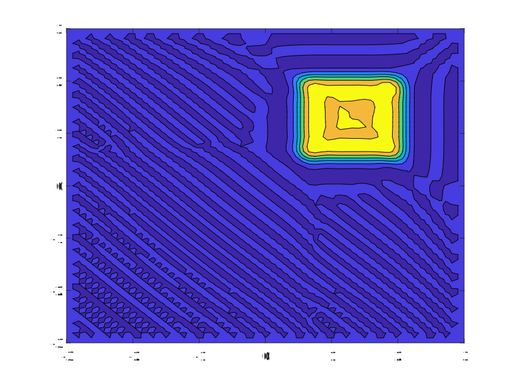

.. _case1_hcsl_simulation:

HCSL Simulation Example
========================

Below is a MATLAB implementation of a CSSL simulation with code and accompanying visual representation.

MATLAB Code
-----------

.. code-block:: matlab

    clc;
    clear;
    tic;
    X=6;%//length of the domain
    Y=X;
    T=2.8;%//time of simulation
    Nx=64;%//the number of cells in space
    Ny=Nx;
    M=560;%//the number of cells in time,time step
    dx=X/Nx;% //this is the size of the space step
    dy=Y/Ny;
    dt=T/M; %//this is the size of the time step
    D=0;%%%扩散系数
    x1=zeros(1,Nx+1); % array allocation
    y1=zeros(1,Ny+1);
    c1=zeros(Nx+1,Ny+1);
    cx1=zeros(Nx+1,Ny+1);
    cy1=zeros(Nx+1,Ny+1);
    cxy1=zeros(Nx+1,Ny+1);
    u=zeros(Nx+1,Ny+1);
    v=zeros(Nx+1,Ny+1);
    r=zeros(Nx+1,Ny+1);
    Cr_x=zeros(Nx+1,Ny+1);
    Cr_y=zeros(Nx+1,Ny+1);
    a_x=zeros(Nx+1,Ny+1);
    a_y=zeros(Nx+1,Ny+1);
    a1_x=zeros(Nx+1,Ny+1);
    a2_x=zeros(Nx+1,Ny+1);
    a3_x=zeros(Nx+1,Ny+1);
    a4_x=zeros(Nx+1,Ny+1);
    a1_y=zeros(Nx+1,Ny+1);
    a2_y=zeros(Nx+1,Ny+1);
    a3_y=zeros(Nx+1,Ny+1);
    a4_y=zeros(Nx+1,Ny+1);
    b1_x=zeros(Nx+1,Ny+1);
    b2_x=zeros(Nx+1,Ny+1);
    b3_x=zeros(Nx+1,Ny+1);
    b4_x=zeros(Nx+1,Ny+1);
    b1_y=zeros(Nx+1,Ny+1);
    b2_y=zeros(Nx+1,Ny+1);
    b3_y=zeros(Nx+1,Ny+1);
    b4_y=zeros(Nx+1,Ny+1);
    R=zeros(Nx+1,Ny+1);
    seita=zeros(Nx+1,Ny+1);
    xd=zeros(Nx+1,Ny+1);
    yd=zeros(Nx+1,Ny+1);
    m=1;

    x0=-1.5;
    y0=-1.5;
    a=1.5;

    for i=1:Nx+1
        for j=1:Ny+1
            x1(i)=dx*(i-(Nx/2+1));
            y1(j)=dy*(j-(Ny/2+1));
            u(i,j)=1;
            v(i,j)=1;
            if abs(x1(i)-x0)<=a/2 && abs(y1(j)-y0)<=a/2
                c1(i,j)=10;
            else
                c1(i,j)=0;
            end
        end
    end

    for i=1:Nx
        for j=1:Ny
            cx1(i,j)=(c1(i+1,j)-c1(i,j))/dx;
            cy1(i,j)=(c1(i,j+1)-c1(i,j))/dy;
        end
    end

    for i=1:Nx+1
        for j=1:Ny+1
            xd(i,j)=x1(i)-u(i,j)*dt;
            yd(i,j)=y1(j)-v(i,j)*dt;
        end
    end

    for i=2:Nx
        for j=2:Ny
    %         cxy1(i,j)=c1(i,j)*(x1(i)-x0)/sx^2*(y1(j)-y0)/sy^2;
            cxy1(i,j)=1/2*(cx1(i,j+1)-cx1(i,j-1))/(2*dy)+1/2*(cy1(i+1,j)-cy1(i-1,j))/(2*dx);
        end
    end

    for i=2:Nx
        for j=2:Ny
    %         if i>=Nx/2+1 && j>Ny/2+1 % for quadrant I & Y positive half shaft
            if xd(i,j)>x1(i) && yd(i,j)<=y1(j) % for situation like (i,j)↖d or (i,j)←d
                Cr_x(i,j)=(x1(i+1)-xd(i,j))/dx;
                Cr_y(i,j)=(y1(j)-yd(i,j))/dy;
    %         elseif i<Nx/2+1 && j>=Ny/2+1 % for quadrant II & X negative half shaft
            elseif xd(i,j)>=x1(i) && yd(i,j)>y1(j) % for situation like (i,j)↙d or d↓(i,j)
                Cr_x(i,j)=(x1(i+1)-xd(i,j))/dx;
                Cr_y(i,j)=(y1(j+1)-yd(i,j))/dy;
    %         elseif i<=Nx/2+1 && j<Ny/2+1 % for quadrant III & Y negative half shaft
            elseif xd(i,j)<x1(i) && yd(i,j)>=y1(j) % for situation like (i,j)↘d or d→(i,j)
                Cr_x(i,j)=(x1(i)-xd(i,j))/dx;
                Cr_y(i,j)=(y1(j+1)-yd(i,j))/dy;
    %         elseif i>Nx/2+1 && j<=Ny/2+1 % for quadrant IV & X positive half shaft
            elseif xd(i,j)<=x1(i) && yd(i,j)<y1(j) % for situation like (i,j)↗d or d↑(i,j)
                Cr_x(i,j)=(x1(i)-xd(i,j))/dx;
                Cr_y(i,j)=(y1(j)-yd(i,j))/dy;
            else
                Cr_x(i,j)=0;
                Cr_y(i,j)=0;
            end

            a_x(i,j)=m*Cr_x(i,j)-fix(m*Cr_x(i,j));
            a_y(i,j)=m*Cr_y(i,j)-fix(m*Cr_y(i,j));

            a1_x(i,j)=a_x(i,j)^2*(3-2*a_x(i,j));
            a2_x(i,j)=1-a1_x(i,j);
            a3_x(i,j)=a_x(i,j)^2*(1-a_x(i,j))*dx;
            a4_x(i,j)=-a_x(i,j)*(1-a_x(i,j))^2*dx;

            a1_y(i,j)=a_y(i,j)^2*(3-2*a_y(i,j));
            a2_y(i,j)=1-a1_y(i,j);
            a3_y(i,j)=a_y(i,j)^2*(1-a_y(i,j))*dy;
            a4_y(i,j)=-a_y(i,j)*(1-a_y(i,j))^2*dy;

            b1_x(i,j)=6*a_x(i,j)*(a_x(i,j)-1)/dx;
            b2_x(i,j)=-b1_x(i,j);
            b3_x(i,j)=a_x(i,j)*(3*a_x(i,j)-2);
            b4_x(i,j)=(a_x(i,j)-1)*(3*a_x(i,j)-1);

            b1_y(i,j)=6*a_y(i,j)*(a_y(i,j)-1)/dy;
            b2_y(i,j)=-b1_y(i,j);
            b3_y(i,j)=a_y(i,j)*(3*a_y(i,j)-2);
            b4_y(i,j)=(a_y(i,j)-1)*(3*a_y(i,j)-1);
        end
    end

    ck=c1;
    cm=c1;
    cl=c1;
    cn=c1;
    cd=c1;
    c2=c1;
    cxk=cx1;
    cxm=cx1;
    cxd=cx1;
    cyl=cy1;
    cyn=cy1;
    cyd=cy1;
    cx2=cx1;
    cy2=cy1;
    cxy2=cxy1;
    e1=c1;
    ex=0;ey=3200;

    for n=1:M
        for i=3:Nx-1
            for j=3:Ny-1
    %%%%%%%%%%  Find out the C, Cx, Cy value at point d
                if xd(i,j)>x1(i) && yd(i,j)<y1(j) % for situation like (i,j)↖d
    %             if i>=Nx/2+1 && j>Ny/2+1 % for quadrant I & Y positive half shaft
                    ck(i,j)=a1_y(i,j)*c1(i,j-1)+a2_y(i,j)*c1(i,j)+a3_y(i,j)*cy1(i,j-1)+a4_y(i,j)*cy1(i,j);
                    cm(i,j)=a1_y(i,j)*c1(i+1,j-1)+a2_y(i,j)*c1(i+1,j)+a3_y(i,j)*cy1(i+1,j-1)+a4_y(i,j)*cy1(i+1,j);
                    cxk(i,j)=a1_y(i,j)*cx1(i,j-1)+a2_y(i,j)*cx1(i,j)+a3_y(i,j)*cxy1(i,j-1)+a4_y(i,j)*cxy1(i,j);
                    cxm(i,j)=a1_y(i,j)*cx1(i+1,j-1)+a2_y(i,j)*cx1(i+1,j)+a3_y(i,j)*cxy1(i+1,j-1)+a4_y(i,j)*cxy1(i+1,j);
                    
                    cl(i,j)=a1_x(i,j)*c1(i,j)+a2_x(i,j)*c1(i+1,j)+a3_x(i,j)*cx1(i,j)+a4_x(i,j)*cx1(i+1,j);
                    cn(i,j)=a1_x(i,j)*c1(i,j-1)+a2_x(i,j)*c1(i+1,j-1)+a3_x(i,j)*cx1(i,j-1)+a4_x(i,j)*cx1(i+1,j-1);
                    cyl(i,j)=a1_x(i,j)*cy1(i,j)+a2_x(i,j)*cy1(i+1,j)+a3_x(i,j)*cxy1(i,j)+a4_x(i,j)*cxy1(i+1,j);
                    cyn(i,j)=a1_x(i,j)*cy1(i,j-1)+a2_x(i,j)*cy1(i+1,j-1)+a3_x(i,j)*cxy1(i,j-1)+a4_x(i,j)*cxy1(i+1,j-1);
                elseif xd(i,j)>x1(i) && yd(i,j)>y1(j) % for situation like (i,j)↙d
    %             elseif i<Nx/2+1 && j>=Ny/2+1 % for quadrant II & X negative half shaft
                    ck(i,j)=a1_y(i,j)*c1(i,j)+a2_y(i,j)*c1(i,j+1)+a3_y(i,j)*cy1(i,j)+a4_y(i,j)*cy1(i,j+1);
                    cm(i,j)=a1_y(i,j)*c1(i+1,j)+a2_y(i,j)*c1(i+1,j+1)+a3_y(i,j)*cy1(i+1,j)+a4_y(i,j)*cy1(i+1,j+1);
                    cxk(i,j)=a1_y(i,j)*cx1(i,j)+a2_y(i,j)*cx1(i,j+1)+a3_y(i,j)*cxy1(i,j)+a4_y(i,j)*cxy1(i,j+1);
                    cxm(i,j)=a1_y(i,j)*cx1(i+1,j)+a2_y(i,j)*cx1(i+1,j+1)+a3_y(i,j)*cxy1(i+1,j)+a4_y(i,j)*cxy1(i+1,j+1);
                    
                    cl(i,j)=a1_x(i,j)*c1(i,j+1)+a2_x(i,j)*c1(i+1,j+1)+a3_x(i,j)*cx1(i,j+1)+a4_x(i,j)*cx1(i+1,j+1);
                    cn(i,j)=a1_x(i,j)*c1(i,j)+a2_x(i,j)*c1(i+1,j)+a3_x(i,j)*cx1(i,j)+a4_x(i,j)*cx1(i+1,j);
                    cyl(i,j)=a1_x(i,j)*cy1(i,j+1)+a2_x(i,j)*cy1(i+1,j+1)+a3_x(i,j)*cxy1(i,j+1)+a4_x(i,j)*cxy1(i+1,j+1);
                    cyn(i,j)=a1_x(i,j)*cy1(i,j)+a2_x(i,j)*cy1(i+1,j)+a3_x(i,j)*cxy1(i,j)+a4_x(i,j)*cxy1(i+1,j);
                elseif xd(i,j)<x1(i) && yd(i,j)>y1(j) % for situation like d↘(i,j)
    %             elseif i<=Nx/2+1 && j<Ny/2+1 % for quadrant III & Y negative half shaft
                    ck(i,j)=a1_y(i,j)*c1(i-1,j)+a2_y(i,j)*c1(i-1,j+1)+a3_y(i,j)*cy1(i-1,j)+a4_y(i,j)*cy1(i-1,j+1);
                    cm(i,j)=a1_y(i,j)*c1(i,j)+a2_y(i,j)*c1(i,j+1)+a3_y(i,j)*cy1(i,j)+a4_y(i,j)*cy1(i,j+1);
                    cxk(i,j)=a1_y(i,j)*cx1(i-1,j)+a2_y(i,j)*cx1(i-1,j+1)+a3_y(i,j)*cxy1(i-1,j)+a4_y(i,j)*cxy1(i-1,j+1);
                    cxm(i,j)=a1_y(i,j)*cx1(i,j)+a2_y(i,j)*cx1(i,j+1)+a3_y(i,j)*cxy1(i,j)+a4_y(i,j)*cxy1(i,j+1);
                    
                    cl(i,j)=a1_x(i,j)*c1(i-1,j+1)+a2_x(i,j)*c1(i,j+1)+a3_x(i,j)*cx1(i-1,j+1)+a4_x(i,j)*cx1(i,j+1);
                    cn(i,j)=a1_x(i,j)*c1(i-1,j)+a2_x(i,j)*c1(i,j)+a3_x(i,j)*cx1(i-1,j)+a4_x(i,j)*cx1(i,j);
                    cyl(i,j)=a1_x(i,j)*cy1(i-1,j+1)+a2_x(i,j)*cy1(i,j+1)+a3_x(i,j)*cxy1(i-1,j+1)+a4_x(i,j)*cxy1(i,j+1);
                    cyn(i,j)=a1_x(i,j)*cy1(i-1,j)+a2_x(i,j)*cy1(i,j)+a3_x(i,j)*cxy1(i-1,j)+a4_x(i,j)*cxy1(i,j);
                elseif xd(i,j)<x1(i) && yd(i,j)<y1(j) % for situation like d↗(i,j)
    %             elseif i>Nx/2+1 && j<=Ny/2+1 % for quadrant IV & X positive half shaft
                    ck(i,j)=a1_y(i,j)*c1(i-1,j-1)+a2_y(i,j)*c1(i-1,j)+a3_y(i,j)*cy1(i-1,j-1)+a4_y(i,j)*cy1(i-1,j);
                    cm(i,j)=a1_y(i,j)*c1(i,j-1)+a2_y(i,j)*c1(i,j)+a3_y(i,j)*cy1(i,j-1)+a4_y(i,j)*cy1(i,j);
                    cxk(i,j)=a1_y(i,j)*cx1(i-1,j-1)+a2_y(i,j)*cx1(i-1,j)+a3_y(i,j)*cxy1(i-1,j-1)+a4_y(i,j)*cxy1(i-1,j);
                    cxm(i,j)=a1_y(i,j)*cx1(i,j-1)+a2_y(i,j)*cx1(i,j)+a3_y(i,j)*cxy1(i,j-1)+a4_y(i,j)*cxy1(i,j);
                    
                    cl(i,j)=a1_x(i,j)*c1(i-1,j)+a2_x(i,j)*c1(i,j)+a3_x(i,j)*cx1(i-1,j)+a4_x(i,j)*cx1(i,j);
                    cn(i,j)=a1_x(i,j)*c1(i-1,j-1)+a2_x(i,j)*c1(i,j-1)+a3_x(i,j)*cx1(i-1,j-1)+a4_x(i,j)*cx1(i,j-1);
                    cyl(i,j)=a1_x(i,j)*cy1(i-1,j)+a2_x(i,j)*cy1(i,j)+a3_x(i,j)*cxy1(i-1,j)+a4_x(i,j)*cxy1(i,j);
                    cyn(i,j)=a1_x(i,j)*cy1(i-1,j-1)+a2_x(i,j)*cy1(i,j-1)+a3_x(i,j)*cxy1(i-1,j-1)+a4_x(i,j)*cxy1(i,j-1);
                elseif xd(i,j)<x1(i) && yd(i,j)==y1(j) %for situation lik d→(i,j)
                    ck(i,j)=c1(i-1,j);
                    cm(i,j)=c1(i,j);
                    cxk(i,j)=cx1(i-1,j);
                    cxm(i,j)=cx1(i,j);
                    
                    cl(i,j)=a1_x(i,j)*c1(i-1,j)+a2_x(i,j)*c1(i,j)+a3_x(i,j)*cx1(i-1,j)+a4_x(i,j)*cx1(i,j);
                    cn(i,j)=a1_x(i,j)*c1(i-1,j)+a2_x(i,j)*c1(i,j)+a3_x(i,j)*cx1(i-1,j)+a4_x(i,j)*cx1(i,j);
                    cyl(i,j)=a1_x(i,j)*cy1(i-1,j)+a2_x(i,j)*cy1(i,j)+a3_x(i,j)*cxy1(i-1,j)+a4_x(i,j)*cxy1(i,j);
                    cyn(i,j)=a1_x(i,j)*cy1(i-1,j)+a2_x(i,j)*cy1(i,j)+a3_x(i,j)*cxy1(i-1,j)+a4_x(i,j)*cxy1(i,j);
                elseif xd(i,j)==x1(i) && yd(i,j)>y1(j) %for situation lik d↓(i,j)
                    ck(i,j)=a1_y(i,j)*c1(i,j)+a2_y(i,j)*c1(i,j+1)+a3_y(i,j)*cy1(i,j)+a4_y(i,j)*cy1(i,j+1);
                    cm(i,j)=a1_y(i,j)*c1(i,j)+a2_y(i,j)*c1(i,j+1)+a3_y(i,j)*cy1(i,j)+a4_y(i,j)*cy1(i,j+1);
                    cxk(i,j)=a1_y(i,j)*cx1(i,j)+a2_y(i,j)*cx1(i,j+1)+a3_y(i,j)*cxy1(i,j)+a4_y(i,j)*cxy1(i,j+1);
                    cxm(i,j)=a1_y(i,j)*cx1(i,j)+a2_y(i,j)*cx1(i,j+1)+a3_y(i,j)*cxy1(i,j)+a4_y(i,j)*cxy1(i,j+1);
                    
                    cl(i,j)=c1(i,j+1);
                    cn(i,j)=c1(i,j);
                    cyl(i,j)=cy1(i,j+1);
                    cyn(i,j)=cy1(i,j);
                elseif xd(i,j)==x1(i) && yd(i,j)<y1(j) %for situation lik d↑(i,j)
                    ck(i,j)=a1_y(i,j)*c1(i,j-1)+a2_y(i,j)*c1(i,j)+a3_y(i,j)*cy1(i,j-1)+a4_y(i,j)*cy1(i,j);
                    cm(i,j)=a1_y(i,j)*c1(i,j-1)+a2_y(i,j)*c1(i,j)+a3_y(i,j)*cy1(i,j-1)+a4_y(i,j)*cy1(i,j);
                    cxk(i,j)=a1_y(i,j)*cx1(i,j-1)+a2_y(i,j)*cx1(i,j)+a3_y(i,j)*cxy1(i,j-1)+a4_y(i,j)*cxy1(i,j);
                    cxm(i,j)=a1_y(i,j)*cx1(i,j-1)+a2_y(i,j)*cx1(i,j)+a3_y(i,j)*cxy1(i,j-1)+a4_y(i,j)*cxy1(i,j);
                    
                    cl(i,j)=c1(i,j);
                    cn(i,j)=c1(i,j-1);
                    cyl(i,j)=cy1(i,j);
                    cyn(i,j)=cy1(i,j-1);
                elseif xd(i,j)>x1(i) && yd(i,j)==y1(j) %for situation lik (i,j)←d
                    ck(i,j)=c1(i,j);
                    cm(i,j)=c1(i+1,j);
                    cxk(i,j)=cx1(i,j);
                    cxm(i,j)=cx1(i+1,j);
                    
                    cl(i,j)=a1_x(i,j)*c1(i,j)+a2_x(i,j)*c1(i+1,j)+a3_x(i,j)*cx1(i,j)+a4_x(i,j)*cx1(i+1,j);
                    cn(i,j)=a1_x(i,j)*c1(i,j)+a2_x(i,j)*c1(i+1,j)+a3_x(i,j)*cx1(i,j)+a4_x(i,j)*cx1(i+1,j);
                    cyl(i,j)=a1_x(i,j)*cy1(i,j)+a2_x(i,j)*cy1(i+1,j)+a3_x(i,j)*cxy1(i,j)+a4_x(i,j)*cxy1(i+1,j);
                    cyn(i,j)=a1_x(i,j)*cy1(i,j)+a2_x(i,j)*cy1(i+1,j)+a3_x(i,j)*cxy1(i,j)+a4_x(i,j)*cxy1(i+1,j);
                end
                cd(i,j)=1/2*(a1_x(i,j)*ck(i,j)+a2_x(i,j)*cm(i,j)+a3_x(i,j)*cxk(i,j)+a4_x(i,j)*cxm(i,j))+1/2*(a1_y(i,j)*cn(i,j)+a2_y(i,j)*cl(i,j)+a3_y(i,j)*cyn(i,j)+a4_y(i,j)*cyl(i,j));
                cxd(i,j)=b1_x(i,j)*ck(i,j)+b2_x(i,j)*cm(i,j)+b3_x(i,j)*cxk(i,j)+b4_x(i,j)*cxm(i,j);
                cyd(i,j)=b1_y(i,j)*cn(i,j)+b2_y(i,j)*cl(i,j)+b3_y(i,j)*cyn(i,j)+b4_y(i,j)*cyl(i,j);
            end
        end
    %%%%%%%%%%  Pass the C value of point d to node(i,j)
        c1=cd;
            
    %%%%%%%%%%  Calculate the Cx, Cy, Cxy value of node(i,j) with the value at
    %%%%%%%%%%  point d
        for i=3:Nx-1
            for j=3:Ny-1
            cx2(i,j)=cxd(i,j);
            cy2(i,j)=cyd(i,j);
            end
        end
        cx1=cx2;cy1=cy2;
        
        for i=3:Nx-1
            for j=3:Ny-1
            cxy2(i,j)=1/2*(cx1(i,j+1)-cx1(i,j-1))/(y1(j+1)-y1(j-1)) + 1/2*(cy1(i+1,j)-cy1(i-1,j))/(x1(i+1)-x1(i-1));
            end
        end
        cxy1=cxy2;

    end

    toc;
    contourf(x1,y1,c1')
    % 设置坐标轴范围
    xlim([-3 3]);  % 设置x轴的范围为-3到3
    ylim([-3 3]);  % 设置y轴的范围为-3到3

    disp(max(max(c1)));
    disp(min(min(c1)));
    saveas(gcf, 'HCSL.svg', 'svg');

Simulation Output
-----------------

The figure below shows the result of the CSSL simulation for pollutant diffusion over time.

   Simulation output displaying pollutant diffusion.

Additional Notes
----------------

- Ensure that MATLAB is installed to run the code.
- Modify parameters `X`, `Y`, `Nx`, `Ny`, and `M` for different simulation setups.

