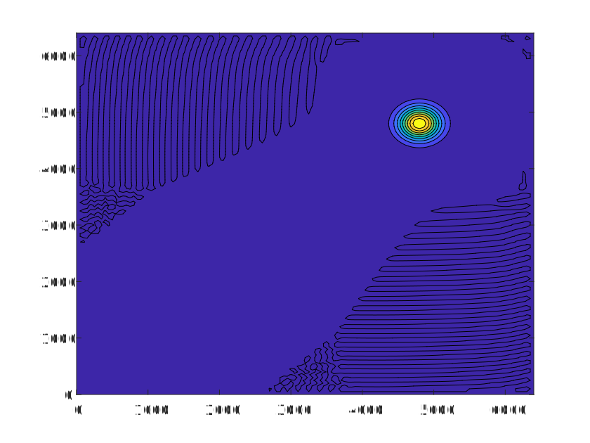
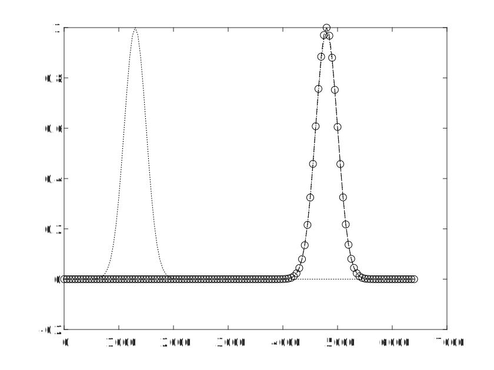

.. _case2_cssl_simulation:

CSSL Simulation Example
========================

Below is a MATLAB implementation of a CSSL simulation with code and accompanying visual representation.

Simulation Output
-----------------

The figure below shows the result of the CSSL simulation for pollutant diffusion over time.

   The Final Distributions of the Gaussian Field Transport Problem

   The Concentration Profiles of the Gaussian Field Transport Problem

MATLAB Code
-----------

.. code-block:: matlab

    % clc;
    clear;
    tic;
    X=6400;%//length of the domain
    Y=X;
    T=3500;%//time of simulation
    Nx=128;%//the number of cells in space
    Ny=Nx;
    M=3500;%//the number of cells in time,time step
    dx=X/Nx;% //this is the size of the space step
    dy=Y/Ny;
    sx=200*1;
    sy=200*1;
    dt=T/M; %//this is the size of the time step
    D=0.1;%%%扩散系数
    x1=zeros(1,Nx+1); % array allocation
    y1=zeros(1,Ny+1);
    c1=zeros(Nx+1,Ny+1);
    c_exact = zeros(Nx+1,Ny+1);
    d=zeros(Nx+1,Ny+1);
    cxx1=zeros(Nx+1,Ny+1);
    cyy1=zeros(Nx+1,Ny+1);
    cxxyy1=zeros(Nx+1,Ny+1);
    u=zeros(Nx+1,Ny+1);
    v=zeros(Nx+1,Ny+1);
    r=zeros(Nx+1,Ny+1);
    Cr_x=zeros(Nx+1,Ny+1);
    Cr_y=zeros(Nx+1,Ny+1);
    a_x=zeros(Nx+1,Ny+1);
    a_y=zeros(Nx+1,Ny+1);

    e1=ones(Nx+1,1); % e1=[1 1 ... 1]
    e2=ones(Nx+1,1); % e2=[1 1 ... 1]
    e3=ones(Nx+1,1); % e3=[1 1 ... 1]
    % %%%  Natural
    Mx=full(spdiags([e1 4*e2 e1],[-1 0 1],Nx+1,Nx+1));
    Mx(1,1)=1;
    Mx(1,2)=0;
    Mx(1,3)=0;
    Mx(Nx+1,Nx-1)=0;
    Mx(Nx+1,Nx)=0;
    Mx(Nx+1,Nx+1)=1;
    My=full(spdiags([e1 4*e2 e1],[-1 0 1],Ny+1,Ny+1));
    My(1,1)=1;
    My(1,2)=0;
    My(1,3)=0;
    My(Ny+1,Ny-1)=0;
    My(Ny+1,Ny)=0;
    My(Ny+1,Ny+1)=1;

    Tx=full(spdiags([e1 -2*e1 e1],[-1 0 1],Nx+1,Nx+1));
    Tx(1,1)=0;
    Tx(1,2)=0;
    Tx(Nx+1,Nx)=0;
    Tx(Nx+1,Nx+1)=0;
    Ty=full(spdiags([e1 -2*e1 e1],[-1 0 1],Ny+1,Ny+1));
    Ty(1,1)=0;
    Ty(1,2)=0;
    Ty(Ny+1,Ny)=0;
    Ty(Ny+1,Ny+1)=0;

    a1_x_l=zeros(Nx+1,Ny+1);
    a2_x_l=zeros(Nx+1,Ny+1);
    a3_x_l=zeros(Nx+1,Ny+1);
    a4_x_l=zeros(Nx+1,Ny+1);
    b1_x_l=zeros(Nx+1,Ny+1);
    b2_x_l=zeros(Nx+1,Ny+1);
    b3_x_l=zeros(Nx+1,Ny+1);
    b4_x_l=zeros(Nx+1,Ny+1);
    a1_y_k=zeros(Nx+1,Ny+1);
    a2_y_k=zeros(Nx+1,Ny+1);
    a3_y_k=zeros(Nx+1,Ny+1);
    a4_y_k=zeros(Nx+1,Ny+1);
    b1_y_k=zeros(Nx+1,Ny+1);
    b2_y_k=zeros(Nx+1,Ny+1);
    b3_y_k=zeros(Nx+1,Ny+1);
    b4_y_k=zeros(Nx+1,Ny+1);

    a1_x_n=zeros(Nx+1,Ny+1);
    a2_x_n=zeros(Nx+1,Ny+1);
    a3_x_n=zeros(Nx+1,Ny+1);
    a4_x_n=zeros(Nx+1,Ny+1);
    b1_x_n=zeros(Nx+1,Ny+1);
    b2_x_n=zeros(Nx+1,Ny+1);
    b3_x_n=zeros(Nx+1,Ny+1);
    b4_x_n=zeros(Nx+1,Ny+1);
    a1_y_m=zeros(Nx+1,Ny+1);
    a2_y_m=zeros(Nx+1,Ny+1);
    a3_y_m=zeros(Nx+1,Ny+1);
    a4_y_m=zeros(Nx+1,Ny+1);
    b1_y_m=zeros(Nx+1,Ny+1);
    b2_y_m=zeros(Nx+1,Ny+1);
    b3_y_m=zeros(Nx+1,Ny+1);
    b4_y_m=zeros(Nx+1,Ny+1);

    a1_xd=zeros(Nx+1,Ny+1);
    a2_xd=zeros(Nx+1,Ny+1);
    a3_xd=zeros(Nx+1,Ny+1);
    a4_xd=zeros(Nx+1,Ny+1);
    a1_yd=zeros(Nx+1,Ny+1);
    a2_yd=zeros(Nx+1,Ny+1);
    a3_yd=zeros(Nx+1,Ny+1);
    a4_yd=zeros(Nx+1,Ny+1);

    seita=zeros(Nx+1,Ny+1);
    xd=zeros(Nx+1,Ny+1);
    yd=zeros(Nx+1,Ny+1);
    m=1;

    x0=1300;
    y0=1300;

    for i=1:Nx+1
        for j=1:Ny+1
            x1(i)=dx*(i-1);
            y1(j)=dy*(j-1);
            cxx1(i,j)=c1(i,j)*((x1(i)-x0)^2/sx^2-1)/(sx^2);
            cyy1(i,j)=c1(i,j)*((y1(j)-y0)^2/sy^2-1)/(sy^2);
            cxxyy1(i,j)=c1(i,j)*((x1(i)-x0)^2/sx^2-1)/(sx^2)*((y1(j)-y0)^2/sy^2-1)/(sy^2);
            u(i,j)=1;
            v(i,j)=1;
            c1(i,j)=exp(-(x1(i)-x0)^2/(2*sx^2)-(y1(j)-y0)^2/(2*sy^2));
        end
    end

    c_exact = c1;

    for i=1:Nx+1
        for j=1:Ny+1
            xd(i,j)=x1(i)-u(i,j)*dt;
            yd(i,j)=y1(j)-v(i,j)*dt;
        end
    end

    for i=1:Nx+1
        for j=1:Ny+1
    %     d(i,j)=exp(-(x1(i)-(x0+u(i,j)*T))^2/(2*sx^2)-(y1(j)-(y0+v(i,j)*T))^2/(2*sy^2));
        d(i,j)=(sx/sqrt(sx^2+2*D*T))*(sy/sqrt(sy^2+2*D*T))*exp(-(x1(i)-(x0+u(i,j)*T))^2/(2*(sx^2+2*D*T))-(y1(j)-(y0+v(i,j)*T))^2/(2*(sy^2+2*D*T)));
        end
    end

    for i=2:Nx
        for j=2:Ny
    %         if i>=Nx/2+1 && j>Ny/2+1 % for quadrant I & Y positive half shaft
            if xd(i,j)>x1(i) && yd(i,j)<=y1(j) % for situation like (i,j)↖d or (i,j)←d
                Cr_x(i,j)=(x1(i+1)-xd(i,j))/dx;
                Cr_y(i,j)=(y1(j)-yd(i,j))/dy;
    %         elseif i<Nx/2+1 && j>=Ny/2+1 % for quadrant II & X negative half shaft
            elseif xd(i,j)>=x1(i) && yd(i,j)>y1(j) % for situation like (i,j)↙d or d↓(i,j)
                Cr_x(i,j)=(x1(i+1)-xd(i,j))/dx;
                Cr_y(i,j)=(y1(j+1)-yd(i,j))/dy;
    %         elseif i<=Nx/2+1 && j<Ny/2+1 % for quadrant III & Y negative half shaft
            elseif xd(i,j)<x1(i) && yd(i,j)>=y1(j) % for situation like (i,j)↘d or d→(i,j)
                Cr_x(i,j)=(x1(i)-xd(i,j))/dx;
                Cr_y(i,j)=(y1(j+1)-yd(i,j))/dy;
    %         elseif i>Nx/2+1 && j<=Ny/2+1 % for quadrant IV & X positive half shaft
            elseif xd(i,j)<=x1(i) && yd(i,j)<y1(j) % for situation like (i,j)↗d or d↑(i,j)
                Cr_x(i,j)=(x1(i)-xd(i,j))/dx;
                Cr_y(i,j)=(y1(j)-yd(i,j))/dy;
            else
                Cr_x(i,j)=0;
                Cr_y(i,j)=0;
            end
            a_x(i,j)=m*Cr_x(i,j)-fix(m*Cr_x(i,j));
            a_y(i,j)=m*Cr_y(i,j)-fix(m*Cr_y(i,j));
        end
    end

    ck=c1;
    cm=c1;
    cl=c1;
    cn=c1;
    cd=c1;
    c2=c1;
    cxxk=cxx1;
    cxxm=cxx1;

    cyyl=cyy1;
    cyyn=cyy1;

    for n=1:M
        for i=2:Nx
            for j=2:Ny
                if xd(i,j)>x1(i) && yd(i,j)<y1(j) % for situation like (i,j)↖d
    %             if i>=Nx/2+1 && j>Ny/2+1 % for quadrant I & Y positive half shaft
                    a1_x_l(i,j)=(cxx1(i,j)-cxx1(i+1,j))/(6*dx);
                    a2_x_l(i,j)=cxx1(i+1,j)/2;
                    a3_x_l(i,j)=(c1(i,j)-c1(i+1,j))/dx-(2*cxx1(i+1,j)+cxx1(i,j))*dx/6;
                    a4_x_l(i,j)=c1(i+1,j);

                    b1_x_l(i,j)=(cxxyy1(i,j)-cxxyy1(i+1,j))/(6*dx);
                    b2_x_l(i,j)=cxxyy1(i+1,j)/2;
                    b3_x_l(i,j)=(cyy1(i,j)-cyy1(i+1,j))/dx-(2*cxxyy1(i+1,j)+cxxyy1(i,j))*dx/6;
                    b4_x_l(i,j)=cyy1(i+1,j);

                    a1_x_n(i,j)=(cxx1(i,j-1)-cxx1(i+1,j-1))/(6*dx);
                    a2_x_n(i,j)=cxx1(i+1,j-1)/2;
                    a3_x_n(i,j)=(c1(i,j-1)-c1(i+1,j-1))/dx-(2*cxx1(i+1,j-1)+cxx1(i,j-1))*dx/6;
                    a4_x_n(i,j)=c1(i+1,j-1);

                    b1_x_n(i,j)=(cxxyy1(i,j-1)-cxxyy1(i+1,j-1))/(6*dx);
                    b2_x_n(i,j)=cxxyy1(i+1,j-1)/2;
                    b3_x_n(i,j)=(cyy1(i,j-1)-cyy1(i+1,j-1))/dx-(2*cxxyy1(i+1,j-1)+cxxyy1(i,j-1))*dx/6;
                    b4_x_n(i,j)=cyy1(i+1,j-1);

                    a1_y_k(i,j)=(cyy1(i,j-1)-cyy1(i,j))/(6*dy);
                    a2_y_k(i,j)=cyy1(i,j)/2;
                    a3_y_k(i,j)=(c1(i,j-1)-c1(i,j))/dy-(2*cyy1(i,j)+cyy1(i,j-1))*dy/6;
                    a4_y_k(i,j)=c1(i,j);

                    b1_y_k(i,j)=(cxxyy1(i,j-1)-cxxyy1(i,j))/(6*dy);
                    b2_y_k(i,j)=cxxyy1(i,j)/2;
                    b3_y_k(i,j)=(cxx1(i,j-1)-cxx1(i,j))/dy-(2*cxxyy1(i,j)+cxxyy1(i,j-1))*dy/6;
                    b4_y_k(i,j)=cxx1(i,j);

                    a1_y_m(i,j)=(cyy1(i+1,j-1)-cyy1(i+1,j))/(6*dy);
                    a2_y_m(i,j)=cyy1(i+1,j)/2;
                    a3_y_m(i,j)=(c1(i+1,j-1)-c1(i+1,j))/dy-(2*cyy1(i+1,j)+cyy1(i+1,j-1))*dy/6;
                    a4_y_m(i,j)=c1(i+1,j);

                    b1_y_m(i,j)=(cxxyy1(i+1,j-1)-cxxyy1(i+1,j))/(6*dy);
                    b2_y_m(i,j)=cxxyy1(i+1,j)/2;
                    b3_y_m(i,j)=(cxx1(i+1,j-1)-cxx1(i+1,j))/dy-(2*cxxyy1(i+1,j)+cxxyy1(i+1,j-1))*dy/6;
                    b4_y_m(i,j)=cxx1(i+1,j);
                elseif xd(i,j)>x1(i) && yd(i,j)>y1(j) % for situation like (i,j)↙d
    %             elseif i<Nx/2+1 && j>=Ny/2+1 % for quadrant II & X negative half shaft
                    a1_x_n(i,j)=(cxx1(i,j)-cxx1(i+1,j))/(6*dx);
                    a2_x_n(i,j)=cxx1(i+1,j)/2;
                    a3_x_n(i,j)=(c1(i,j)-c1(i+1,j))/dx-(2*cxx1(i+1,j)+cxx1(i,j))*dx/6;
                    a4_x_n(i,j)=c1(i+1,j);

                    b1_x_n(i,j)=(cxxyy1(i,j)-cxxyy1(i+1,j))/(6*dx);
                    b2_x_n(i,j)=cxxyy1(i+1,j)/2;
                    b3_x_n(i,j)=(cyy1(i,j)-cyy1(i+1,j))/dx-(2*cxxyy1(i+1,j)+cxxyy1(i,j))*dx/6;
                    b4_x_n(i,j)=cyy1(i+1,j);

                    a1_y_k(i,j)=(cyy1(i,j)-cyy1(i,j+1))/(6*dy);
                    a2_y_k(i,j)=cyy1(i,j+1)/2;
                    a3_y_k(i,j)=(c1(i,j)-c1(i,j+1))/dy-(2*cyy1(i,j+1)+cyy1(i,j))*dy/6;
                    a4_y_k(i,j)=c1(i,j+1);
                    
                    b1_y_k(i,j)=(cxxyy1(i,j)-cxxyy1(i,j+1))/(6*dy);
                    b2_y_k(i,j)=cxxyy1(i,j+1)/2;
                    b3_y_k(i,j)=(cxx1(i,j)-cxx1(i,j+1))/dy-(2*cxxyy1(i,j+1)+cxxyy1(i,j))*dy/6;
                    b4_y_k(i,j)=cxx1(i,j+1);
                    
                    a1_x_l(i,j)=(cxx1(i,j+1)-cxx1(i+1,j+1))/(6*dx);
                    a2_x_l(i,j)=cxx1(i+1,j+1)/2;
                    a3_x_l(i,j)=(c1(i,j+1)-c1(i+1,j+1))/dx-(2*cxx1(i+1,j+1)+cxx1(i,j+1))*dx/6;
                    a4_x_l(i,j)=c1(i+1,j+1);

                    b1_x_l(i,j)=(cxxyy1(i,j+1)-cxxyy1(i+1,j+1))/(6*dx);
                    b2_x_l(i,j)=cxxyy1(i+1,j+1)/2;
                    b3_x_l(i,j)=(cyy1(i,j+1)-cyy1(i+1,j+1))/dx-(2*cxxyy1(i+1,j+1)+cxxyy1(i,j+1))*dx/6;
                    b4_x_l(i,j)=cyy1(i+1,j+1);

                    a1_y_m(i,j)=(cyy1(i+1,j)-cyy1(i+1,j+1))/(6*dy);
                    a2_y_m(i,j)=cyy1(i+1,j+1)/2;
                    a3_y_m(i,j)=(c1(i+1,j)-c1(i+1,j+1))/dy-(2*cyy1(i+1,j+1)+cyy1(i+1,j))*dy/6;
                    a4_y_m(i,j)=c1(i+1,j+1);

                    b1_y_m(i,j)=(cxxyy1(i+1,j)-cxxyy1(i+1,j+1))/(6*dy);
                    b2_y_m(i,j)=cxxyy1(i+1,j+1)/2;
                    b3_y_m(i,j)=(cxx1(i+1,j)-cxx1(i+1,j+1))/dy-(2*cxxyy1(i+1,j+1)+cxxyy1(i+1,j))*dy/6;
                    b4_y_m(i,j)=cxx1(i+1,j+1);
                elseif xd(i,j)<x1(i) && yd(i,j)>y1(j) % for situation like d↘(i,j)
    %             elseif i<=Nx/2+1 && j<Ny/2+1 % for quadrant III & Y negative half shaft
                    a1_x_n(i,j)=(cxx1(i-1,j)-cxx1(i,j))/(6*dx);
                    a2_x_n(i,j)=cxx1(i,j)/2;
                    a3_x_n(i,j)=(c1(i-1,j)-c1(i,j))/dx-(2*cxx1(i,j)+cxx1(i-1,j))*dx/6;
                    a4_x_n(i,j)=c1(i,j);

                    b1_x_n(i,j)=(cxxyy1(i-1,j)-cxxyy1(i,j))/(6*dx);
                    b2_x_n(i,j)=cxxyy1(i,j)/2;
                    b3_x_n(i,j)=(cyy1(i-1,j)-cyy1(i,j))/dx-(2*cxxyy1(i,j)+cxxyy1(i-1,j))*dx/6;
                    b4_x_n(i,j)=cyy1(i,j);

                    a1_y_m(i,j)=(cyy1(i,j)-cyy1(i,j+1))/(6*dy);
                    a2_y_m(i,j)=cyy1(i,j+1)/2;
                    a3_y_m(i,j)=(c1(i,j)-c1(i,j+1))/dy-(2*cyy1(i,j+1)+cyy1(i,j))*dy/6;
                    a4_y_m(i,j)=c1(i,j+1);

                    b1_y_m(i,j)=(cxxyy1(i,j)-cxxyy1(i,j+1))/(6*dy);
                    b2_y_m(i,j)=cxxyy1(i,j+1)/2;
                    b3_y_m(i,j)=(cxx1(i,j)-cxx1(i,j+1))/dy-(2*cxxyy1(i,j+1)+cxxyy1(i,j))*dy/6;
                    b4_y_m(i,j)=cxx1(i,j+1);

                    a1_x_l(i,j)=(cxx1(i-1,j+1)-cxx1(i,j+1))/(6*dx);
                    a2_x_l(i,j)=cxx1(i,j+1)/2;
                    a3_x_l(i,j)=(c1(i-1,j+1)-c1(i,j+1))/dx-(2*cxx1(i,j+1)+cxx1(i-1,j+1))*dx/6;
                    a4_x_l(i,j)=c1(i,j+1);

                    b1_x_l(i,j)=(cxxyy1(i-1,j+1)-cxxyy1(i,j+1))/(6*dx);
                    b2_x_l(i,j)=cxxyy1(i,j+1)/2;
                    b3_x_l(i,j)=(cyy1(i-1,j+1)-cyy1(i,j+1))/dx-(2*cxxyy1(i,j+1)+cxxyy1(i-1,j+1))*dx/6;
                    b4_x_l(i,j)=cyy1(i,j+1);

                    a1_y_k(i,j)=(cyy1(i-1,j)-cyy1(i-1,j+1))/(6*dy);
                    a2_y_k(i,j)=cyy1(i-1,j+1)/2;
                    a3_y_k(i,j)=(c1(i-1,j)-c1(i-1,j+1))/dy-(2*cyy1(i-1,j+1)+cyy1(i-1,j))*dy/6;
                    a4_y_k(i,j)=c1(i-1,j+1);

                    b1_y_k(i,j)=(cxxyy1(i-1,j)-cxxyy1(i-1,j+1))/(6*dy);
                    b2_y_k(i,j)=cxxyy1(i-1,j+1)/2;
                    b3_y_k(i,j)=(cxx1(i-1,j)-cxx1(i-1,j+1))/dy-(2*cxxyy1(i-1,j+1)+cxxyy1(i-1,j))*dy/6;
                    b4_y_k(i,j)=cxx1(i-1,j+1);
                elseif xd(i,j)<x1(i) && yd(i,j)<y1(j) % for situation like d↗(i,j)
    %             elseif i>Nx/2+1 && j<=Ny/2+1 % for quadrant IV & X positive half shaft
                    a1_x_l(i,j)=(cxx1(i-1,j)-cxx1(i,j))/(6*dx);
                    a2_x_l(i,j)=cxx1(i,j)/2;
                    a3_x_l(i,j)=(c1(i-1,j)-c1(i,j))/dx-(2*cxx1(i,j)+cxx1(i-1,j))*dx/6;
                    a4_x_l(i,j)=c1(i,j);

                    b1_x_l(i,j)=(cxxyy1(i-1,j)-cxxyy1(i,j))/(6*dx);
                    b2_x_l(i,j)=cxxyy1(i,j)/2;
                    b3_x_l(i,j)=(cyy1(i-1,j)-cyy1(i,j))/dx-(2*cxxyy1(i,j)+cxxyy1(i-1,j))*dx/6;
                    b4_x_l(i,j)=cyy1(i,j);
                    
                    a1_x_n(i,j)=(cxx1(i-1,j-1)-cxx1(i,j-1))/(6*dx);
                    a2_x_n(i,j)=cxx1(i,j-1)/2;
                    a3_x_n(i,j)=(c1(i-1,j-1)-c1(i,j-1))/dx-(2*cxx1(i,j-1)+cxx1(i-1,j-1))*dx/6;
                    a4_x_n(i,j)=c1(i,j-1);

                    b1_x_n(i,j)=(cxxyy1(i-1,j-1)-cxxyy1(i,j-1))/(6*dx);
                    b2_x_n(i,j)=cxxyy1(i,j-1)/2;
                    b3_x_n(i,j)=(cyy1(i-1,j-1)-cyy1(i,j-1))/dx-(2*cxxyy1(i,j-1)+cxxyy1(i-1,j-1))*dx/6;
                    b4_x_n(i,j)=cyy1(i,j-1);

                    a1_y_m(i,j)=(cyy1(i,j-1)-cyy1(i,j))/(6*dy);
                    a2_y_m(i,j)=cyy1(i,j)/2;
                    a3_y_m(i,j)=(c1(i,j-1)-c1(i,j))/dy-(2*cyy1(i,j)+cyy1(i,j-1))*dy/6;
                    a4_y_m(i,j)=c1(i,j);
                    
                    b1_y_m(i,j)=(cxxyy1(i,j-1)-cxxyy1(i,j))/(6*dy);
                    b2_y_m(i,j)=cxxyy1(i,j)/2;
                    b3_y_m(i,j)=(cxx1(i,j-1)-cxx1(i,j))/dy-(2*cxxyy1(i,j)+cxxyy1(i,j-1))*dy/6;
                    b4_y_m(i,j)=cxx1(i,j);
                    
                    a1_y_k(i,j)=(cyy1(i-1,j-1)-cyy1(i-1,j))/(6*dy);
                    a2_y_k(i,j)=cyy1(i-1,j)/2;
                    a3_y_k(i,j)=(c1(i-1,j-1)-c1(i-1,j))/dy-(2*cyy1(i-1,j)+cyy1(i-1,j-1))*dy/6;
                    a4_y_k(i,j)=c1(i-1,j);
                    
                    b1_y_k(i,j)=(cxxyy1(i-1,j-1)-cxxyy1(i-1,j))/(6*dy);
                    b2_y_k(i,j)=cxxyy1(i-1,j)/2;
                    b3_y_k(i,j)=(cxx1(i-1,j-1)-cxx1(i-1,j))/dy-(2*cxxyy1(i-1,j)+cxxyy1(i-1,j-1))*dy/6;
                    b4_y_k(i,j)=cxx1(i-1,j);
                    
                    
                    
                    
                elseif xd(i,j)==x1(i) && yd(i,j)<y1(j) % for situation like (i,j)↑d
                    a1_y_k(i,j)=(cyy1(i,j-1)-cyy1(i,j))/(6*dy);
                    a2_y_k(i,j)=cyy1(i,j)/2;
                    a3_y_k(i,j)=(c1(i,j-1)-c1(i,j))/dy-(2*cyy1(i,j)+cyy1(i,j-1))*dy/6;
                    a4_y_k(i,j)=c1(i,j);

                    b1_y_k(i,j)=(cxxyy1(i,j-1)-cxxyy1(i,j))/(6*dy);
                    b2_y_k(i,j)=cxxyy1(i,j)/2;
                    b3_y_k(i,j)=(cxx1(i,j-1)-cxx1(i,j))/dy-(2*cxxyy1(i,j)+cxxyy1(i,j-1))*dy/6;
                    b4_y_k(i,j)=cxx1(i,j);
                    
                    a1_y_m(i,j)=(cyy1(i,j-1)-cyy1(i,j))/(6*dy);
                    a2_y_m(i,j)=cyy1(i,j)/2;
                    a3_y_m(i,j)=(c1(i,j-1)-c1(i,j))/dy-(2*cyy1(i,j)+cyy1(i,j-1))*dy/6;
                    a4_y_m(i,j)=c1(i,j);
                    
                    b1_y_m(i,j)=(cxxyy1(i,j-1)-cxxyy1(i,j))/(6*dy);
                    b2_y_m(i,j)=cxxyy1(i,j)/2;
                    b3_y_m(i,j)=(cxx1(i,j-1)-cxx1(i,j))/dy-(2*cxxyy1(i,j)+cxxyy1(i,j-1))*dy/6;
                    b4_y_m(i,j)=cxx1(i,j);
                    
                    a1_x_l(i,j)=0;
                    a2_x_l(i,j)=0;
                    a3_x_l(i,j)=0;
                    a4_x_l(i,j)=c1(i,j);

                    b1_x_l(i,j)=0;
                    b2_x_l(i,j)=0;
                    b3_x_l(i,j)=0;
                    b4_x_l(i,j)=cyy1(i,j);

                    a1_x_n(i,j)=0;
                    a2_x_n(i,j)=0;
                    a3_x_n(i,j)=0;
                    a4_x_n(i,j)=c1(i,j-1);

                    b1_x_n(i,j)=0;
                    b2_x_n(i,j)=0;
                    b3_x_n(i,j)=0;
                    b4_x_n(i,j)=cyy1(i,j-1);
                elseif xd(i,j)>x1(i) && yd(i,j)==y1(j) % for situation like (i,j)←d
                    a1_y_k(i,j)=0;
                    a2_y_k(i,j)=0;
                    a3_y_k(i,j)=0;
                    a4_y_k(i,j)=c1(i,j);
                    
                    b1_y_k(i,j)=0;
                    b2_y_k(i,j)=0;
                    b3_y_k(i,j)=0;
                    b4_y_k(i,j)=cxx1(i,j);
                    
                    a1_y_m(i,j)=0;
                    a2_y_m(i,j)=0;
                    a3_y_m(i,j)=0;
                    a4_y_m(i,j)=c1(i+1,j);
                    
                    b1_y_m(i,j)=0;
                    b2_y_m(i,j)=0;
                    b3_y_m(i,j)=0;
                    b4_y_m(i,j)=cxx1(i+1,j);
                    
                    a1_x_l(i,j)=(cxx1(i,j)-cxx1(i+1,j))/(6*dx);
                    a2_x_l(i,j)=cxx1(i+1,j)/2;
                    a3_x_l(i,j)=(c1(i,j)-c1(i+1,j))/dx-(2*cxx1(i+1,j)+cxx1(i,j))*dx/6;
                    a4_x_l(i,j)=c1(i+1,j);

                    b1_x_l(i,j)=(cxxyy1(i,j)-cxxyy1(i+1,j))/(6*dx);
                    b2_x_l(i,j)=cxxyy1(i+1,j)/2;
                    b3_x_l(i,j)=(cyy1(i,j)-cyy1(i+1,j))/dx-(2*cxxyy1(i+1,j)+cxxyy1(i,j))*dx/6;
                    b4_x_l(i,j)=cyy1(i+1,j);
                    
                    a1_x_n(i,j)=(cxx1(i,j)-cxx1(i+1,j))/(6*dx);
                    a2_x_n(i,j)=cxx1(i+1,j)/2;
                    a3_x_n(i,j)=(c1(i,j)-c1(i+1,j))/dx-(2*cxx1(i+1,j)+cxx1(i,j))*dx/6;
                    a4_x_n(i,j)=c1(i+1,j);

                    b1_x_n(i,j)=(cxxyy1(i,j)-cxxyy1(i+1,j))/(6*dx);
                    b2_x_n(i,j)=cxxyy1(i+1,j)/2;
                    b3_x_n(i,j)=(cyy1(i,j)-cyy1(i+1,j))/dx-(2*cxxyy1(i+1,j)+cxxyy1(i,j))*dx/6;
                    b4_x_n(i,j)=cyy1(i+1,j);
                elseif xd(i,j)==x1(i) && yd(i,j)>y1(j) % for situation like (i,j)↓d
                    a1_y_k(i,j)=(cyy1(i,j)-cyy1(i,j+1))/(6*dy);
                    a2_y_k(i,j)=cyy1(i,j+1)/2;
                    a3_y_k(i,j)=(c1(i,j)-c1(i,j+1))/dy-(2*cyy1(i,j+1)+cyy1(i,j))*dy/6;
                    a4_y_k(i,j)=c1(i,j+1);
                    
                    b1_y_k(i,j)=(cxxyy1(i,j)-cxxyy1(i,j+1))/(6*dy);
                    b2_y_k(i,j)=cxxyy1(i,j+1)/2;
                    b3_y_k(i,j)=(cxx1(i,j)-cxx1(i,j+1))/dy-(2*cxxyy1(i,j+1)+cxxyy1(i,j))*dy/6;
                    b4_y_k(i,j)=cxx1(i,j+1);
                    
                    a1_y_m(i,j)=(cyy1(i,j)-cyy1(i,j+1))/(6*dy);
                    a2_y_m(i,j)=cyy1(i,j+1)/2;
                    a3_y_m(i,j)=(c1(i,j)-c1(i,j+1))/dy-(2*cyy1(i,j+1)+cyy1(i,j))*dy/6;
                    a4_y_m(i,j)=c1(i,j+1);

                    b1_y_m(i,j)=(cxxyy1(i,j)-cxxyy1(i,j+1))/(6*dy);
                    b2_y_m(i,j)=cxxyy1(i,j+1)/2;
                    b3_y_m(i,j)=(cxx1(i,j)-cxx1(i,j+1))/dy-(2*cxxyy1(i,j+1)+cxxyy1(i,j))*dy/6;
                    b4_y_m(i,j)=cxx1(i,j+1);
                    
                    a1_x_l(i,j)=0;
                    a2_x_l(i,j)=0;
                    a3_x_l(i,j)=0;
                    a4_x_l(i,j)=c1(i,j+1);

                    b1_x_l(i,j)=0;
                    b2_x_l(i,j)=0;
                    b3_x_l(i,j)=0;
                    b4_x_l(i,j)=cyy1(i,j+1);

                    a1_x_n(i,j)=0;
                    a2_x_n(i,j)=0;
                    a3_x_n(i,j)=0;
                    a4_x_n(i,j)=c1(i,j);

                    b1_x_n(i,j)=0;
                    b2_x_n(i,j)=0;
                    b3_x_n(i,j)=0;
                    b4_x_n(i,j)=cyy1(i,j);
                elseif xd(i,j)<x1(i) && yd(i,j)==y1(j) % for situation like (i,j)→d
                    a1_y_k(i,j)=0;
                    a2_y_k(i,j)=0;
                    a3_y_k(i,j)=0;
                    a4_y_k(i,j)=c1(i-1,j);
                    
                    b1_y_k(i,j)=0;
                    b2_y_k(i,j)=0;
                    b3_y_k(i,j)=0;
                    b4_y_k(i,j)=cxx1(i-1,j);
                    
                    a1_y_m(i,j)=0;
                    a2_y_m(i,j)=0;
                    a3_y_m(i,j)=0;
                    a4_y_m(i,j)=c1(i,j);
                    
                    b1_y_m(i,j)=0;
                    b2_y_m(i,j)=0;
                    b3_y_m(i,j)=0;
                    b4_y_m(i,j)=cxx1(i,j);
                    
                    a1_x_l(i,j)=(cxx1(i-1,j)-cxx1(i,j))/(6*dx);
                    a2_x_l(i,j)=cxx1(i,j)/2;
                    a3_x_l(i,j)=(c1(i-1,j)-c1(i,j))/dx-(2*cxx1(i,j)+cxx1(i-1,j))*dx/6;
                    a4_x_l(i,j)=c1(i,j);

                    b1_x_l(i,j)=(cxxyy1(i-1,j)-cxxyy1(i,j))/(6*dx);
                    b2_x_l(i,j)=cxxyy1(i,j)/2;
                    b3_x_l(i,j)=(cyy1(i-1,j)-cyy1(i,j))/dx-(2*cxxyy1(i,j)+cxxyy1(i-1,j))*dx/6;
                    b4_x_l(i,j)=cyy1(i,j);
                    
                    a1_x_n(i,j)=(cxx1(i-1,j)-cxx1(i,j))/(6*dx);
                    a2_x_n(i,j)=cxx1(i,j)/2;
                    a3_x_n(i,j)=(c1(i-1,j)-c1(i,j))/dx-(2*cxx1(i,j)+cxx1(i-1,j))*dx/6;
                    a4_x_n(i,j)=c1(i,j);

                    b1_x_n(i,j)=(cxxyy1(i-1,j)-cxxyy1(i,j))/(6*dx);
                    b2_x_n(i,j)=cxxyy1(i,j)/2;
                    b3_x_n(i,j)=(cyy1(i-1,j)-cyy1(i,j))/dx-(2*cxxyy1(i,j)+cxxyy1(i-1,j))*dx/6;
                    b4_x_n(i,j)=cyy1(i,j);
                    
                else
                    a1_x_l(i,j)=0;
                    a2_x_l(i,j)=0;
                    a3_x_l(i,j)=0;
                    a4_x_l(i,j)=0;

                    b1_x_l(i,j)=0;
                    b2_x_l(i,j)=0;
                    b3_x_l(i,j)=0;
                    b4_x_l(i,j)=0;

                    a1_y_k(i,j)=0;
                    a2_y_k(i,j)=0;
                    a3_y_k(i,j)=0;
                    a4_y_k(i,j)=0;

                    b1_y_k(i,j)=0;
                    b2_y_k(i,j)=0;
                    b3_y_k(i,j)=0;
                    b4_y_k(i,j)=0;
                    
                    a1_x_n(i,j)=0;
                    a1_x_n(i,j)=0;
                    a1_x_n(i,j)=0;
                    a1_x_n(i,j)=0;
                    
                    b1_x_n(i,j)=0;
                    b2_x_n(i,j)=0;
                    b3_x_n(i,j)=0;
                    b4_x_n(i,j)=0;
                    
                    a1_y_m(i,j)=0;
                    a2_y_m(i,j)=0;
                    a3_y_m(i,j)=0;
                    a4_y_m(i,j)=0;

                    b1_y_m(i,j)=0;
                    b2_y_m(i,j)=0;
                    b3_y_m(i,j)=0;
                    b4_y_m(i,j)=0;
                end
            end
        end

    %%%%%%%%%%%%%%%%%-----2 & 3
        for i=3:Nx-1
            for j=3:Ny-1
                hx=[(a_x(i,j)*dx)^3 (a_x(i,j)*dx)^2 (a_x(i,j)*dx) 1]';
                hy=[(a_y(i,j)*dy)^3 (a_y(i,j)*dy)^2 (a_y(i,j)*dy) 1]';
                ck(i,j)=[a1_y_k(i,j) a2_y_k(i,j) a3_y_k(i,j) a4_y_k(i,j)]*hy;
                cm(i,j)=[a1_y_m(i,j) a2_y_m(i,j) a3_y_m(i,j) a4_y_m(i,j)]*hy;
                cl(i,j)=[a1_x_l(i,j) a2_x_l(i,j) a3_x_l(i,j) a4_x_l(i,j)]*hx;
                cn(i,j)=[a1_x_n(i,j) a2_x_n(i,j) a3_x_n(i,j) a4_x_n(i,j)]*hx;
                
                cxxk(i,j)=[b1_y_k(i,j) b2_y_k(i,j) b3_y_k(i,j) b4_y_k(i,j)]*hy;
                cxxm(i,j)=[b1_y_m(i,j) b2_y_m(i,j) b3_y_m(i,j) b4_y_m(i,j)]*hy;
                cyyl(i,j)=[b1_x_l(i,j) b2_x_l(i,j) b3_x_l(i,j) b4_x_l(i,j)]*hx;
                cyyn(i,j)=[b1_x_n(i,j) b2_x_n(i,j) b3_x_n(i,j) b4_x_n(i,j)]*hx;
                
                a1_xd(i,j)=(cxxk(i,j)-cxxm(i,j))/(6*dx);
                a2_xd(i,j)=cxxm(i,j)/2;
                a3_xd(i,j)=(ck(i,j)-cm(i,j))/dx-(2*cxxm(i,j)+cxxk(i,j))*dx/6;
                a4_xd(i,j)=cm(i,j);
                
                a1_yd(i,j)=(cyyn(i,j)-cyyl(i,j))/(6*dy);
                a2_yd(i,j)=cyyl(i,j)/2;
                a3_yd(i,j)=(cn(i,j)-cl(i,j))/dy-(2*cyyl(i,j)+cyyn(i,j))*dy/6;
                a4_yd(i,j)=cl(i,j);
                
                cd(i,j)=1/2*([a1_xd(i,j) a2_xd(i,j) a3_xd(i,j) a4_xd(i,j)]*hx)+1/2*([a1_yd(i,j) a2_yd(i,j) a3_yd(i,j) a4_yd(i,j)]*hy);
            end
        end

    %%%%%%%%%%%%%%%%%-----4
    %%%%%%%%%%  Pass the C value of point d to node(i,j)
        c1=cd;
    %%%%%%%%%%%%%%%%%-----5
        for j=1:Ny+1
            cxx1(:,j)=Mx\(6/dx^2*Tx*c1(:,j));
        end
    %     c1(:,1)=zeros(Nx+1,1);
    % %     cxx1(:,1)=zeros(Nx+1,1);
    %     cxx1(:,1)=cxx1(:,2);
    %     c1(:,Ny+1)=zeros(Nx+1,1);
    % %     cxx1(:,Ny+1)=zeros(Nx+1,1);
    %     cxx1(:,Ny+1)=cxx1(:,Nx);
        
        for i=1:Nx+1
            cyy1(i,:)=My\(6/dy^2*Ty*c1(i,:)');
        end
    %     c1(1,:)=zeros(1,Ny+1);
    % %     cyy1(1,:)=zeros(1,Ny+1);
    %     cyy1(1,:)=cyy1(2,:);
    %     c1(Nx+1,:)=zeros(1,Ny+1);
    % %     cyy1(Nx+1,:)=zeros(1,Ny+1);
    %     cyy1(Nx+1,:)=cyy1(Nx,:);
        
        for i=2:Nx
            for j=2:Ny
                cxxyy1(i,j)=1/2*((cxx1(i+1,j)-2*cxx1(i,j)+cxx1(i-1,j))/(dx)^2)+1/2*((cyy1(i,j+1)-2*cyy1(i,j)+cyy1(i,j-1))/(dy)^2);
            end
        end
        
    %     if mod(n,1)==0 %&& n>150
    %         figure(10);
    %         hold on;
    %         xlabel("x");
    %         ylabel("y");
    %         contourf(x1,y1,c1');
    %         title(n+"/"+M);
    %     end

    end

    toc;

    % figure(14)
    % hold on
    % plot(x1,c1(:,Ny/4*3+1),'r');
    % xlabel("x");
    % ylabel("C");
    % legend({"Exact solution",Nx+"x"+Ny},"Location","northwest");
    % title(Nx+"x"+Ny);
    % maxvalue=max(max(c1));
    % text(-7500,0.75,"max:"+maxvalue);
    % hold off

    close all;    % 关闭所有图形窗口
    figure;       % 创建一个新的图形窗口
    contourf(x1,y1,c1');
    saveas(gcf,"CSSL1.svg", 'svg');

    close all;    % 关闭所有图形窗口
    figure;       % 创建一个新的图形窗口
    hold on;
    box on;
    plot(x1,c_exact(:,27),':k');
    plot(x1,d(:,Ny/4*3+1),'-k');
    plot(x1,c1(:,Ny/4*3+1),'--ko');
    hold off
    saveas(gcf,"CSSL2.svg", 'svg');
    disp(max(max(c1)));
    disp(min(min(c1)));

Additional Notes
----------------

- Ensure that MATLAB is installed to run the code.
- Modify parameters `X`, `Y`, `Nx`, `Ny`, and `M` for different simulation setups.

